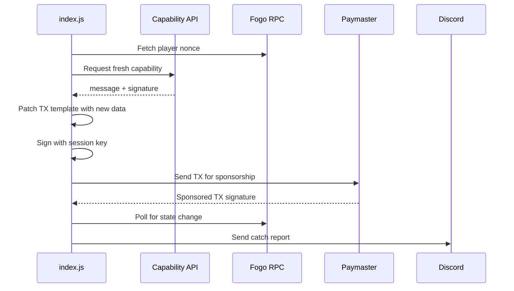

# Fishing Bot

Headless Node.js bot for automated fishing in [Fogo Fishing](https://app.fogofishing.com) game on Fogo chain.

## ✅ Features
- 🎣 Auto-cast fishing line
- 📊 Fish tracking per cast  
- 💬 Discord webhook notifications
- 🖥️ No WebGL required

## How It Works



## Quick Start

```bash
# 1. Install dependencies
npm install

# 2. Copy .env-example to .env and fill in your values
cp .env-example .env

# 3. Run the bot
node index.js
```

## Configuration (.env)

| Variable | Description |
|----------|-------------|
| `SESSION_KEY_B58` | Session key from browser (base58) |
| `OWNER` | Wallet public key |
| `DISCORD_WEBHOOK_URL` | Discord webhook for notifications |
| `CAST_INTERVAL_MS` | Delay between casts (default: 3000ms) |
| `MAX_CASTS` | Max casts (0 = unlimited) |
| `TX_TEMPLATE_B64` | Browser TX template |

---

## How to Get Session Key

### Method 1: Tampermonkey (Recommended)

Console intercept scripts often fail because keys are generated with `extractable: false`. **Tampermonkey** intercepts BEFORE page load, guaranteeing success.

1. Install [Tampermonkey](https://www.tampermonkey.net/) browser extension
2. Click Tampermonkey icon → **Create new script**
3. Replace all content with:

```javascript
// ==UserScript==
// @name         Fogo Session Extractor
// @namespace    http://tampermonkey.net/
// @version      1.0
// @match        *://*fogo*/*
// @run-at       document-start
// @grant        unsafeWindow
// ==/UserScript==

(function() {
    console.log("=== TAMPERMONKEY STARTING ===");
    
    indexedDB.deleteDatabase("sessionsdb");
    
    const target = unsafeWindow.crypto || window.crypto;
    const orig = target.subtle.generateKey.bind(target.subtle);
    
    target.subtle.generateKey = async function(algo, ext, usages) {
        console.log("🔓 INTERCEPTED generateKey!");
        const result = await orig(algo, true, usages);
        
        if (result.privateKey) {
            try {
                const priv = await target.subtle.exportKey('pkcs8', result.privateKey);
                const pub = await target.subtle.exportKey('raw', result.publicKey);
                console.log('====================================');
                console.log('🔑 SESSION KEY CAPTURED!');
                console.log('PRIVATE_PKCS8_B64:', btoa(String.fromCharCode(...new Uint8Array(priv))));
                console.log('PUBLIC_RAW_B64:', btoa(String.fromCharCode(...new Uint8Array(pub))));
                console.log('====================================');
            } catch(e) {
                console.log("Export error:", e);
            }
        }
        return result;
    };
    
    console.log("=== TAMPERMONKEY READY ===");
})();
```

4. Press **Ctrl+S** to save
5. **Close** all Fogo tabs
6. Open https://app.fogofishing.com
7. Login and Open DevTools (F12) → Console
8. Find **PRIVATE_PKCS8_B64** value

9. Convert to SESSION_KEY_B58:
```bash
node convert-session.js
```

10. Copy the `SESSION_KEY_B58` output to your `.env` file

---

### Method 2: Console Script (May fail if key not extractable)

1. Open [Fogo Fishing](https://app.fogofishing.com) and login
2. Open DevTools (F12) → Console
3. Paste this script:

```javascript
(async () => {
  const request = indexedDB.open("sessionsdb");
  request.onsuccess = async (e) => {
    const db = e.target.result;
    const tx = db.transaction("sessions", "readonly");
    tx.objectStore("sessions").getAll().onsuccess = async (ev) => {
      const item = ev.target.result[0];
      const privPkcs8 = await crypto.subtle.exportKey("pkcs8", item.sessionKey.privateKey);
      console.log("PRIVATE_PKCS8_B64:", btoa(String.fromCharCode(...new Uint8Array(privPkcs8))));
    };
  };
})();
```

4. If you get "key is not extractable" error, use **Method 1 (Tampermonkey)** instead.

---

## How to Get TX_TEMPLATE_B64

> ⚠️ **Important**: You must capture TX_TEMPLATE AFTER session key is registered. Cast once in browser first!

1. Open [Fogo Fishing](https://app.fogofishing.com) and login
2. Open DevTools (F12) → **Network tab**
3. Click "Cast" button in the game
4. Find the request to `sponsor_and_send`
5. Click on it → **Payload tab** → copy the `transaction` value
6. Paste into `TX_TEMPLATE_B64` in `.env`

---

## Running

```bash
# Single terminal
node index.js

# Background (pm2)
pm2 start index.js --name fogo-bot

# VPS with screen
screen -S fogo
node index.js
# Ctrl+A, D to detach
```

## Troubleshooting

| Error | Solution |
|-------|----------|
| `Cannot sign with non signer key` | Session key not registered on-chain. Cast in browser first, then capture new TX_TEMPLATE |
| `key is not extractable` | Use Tampermonkey method instead of console scripts |
| `provided secretKey is invalid` | Re-run convert-session.js with PRIVATE_PKCS8_B64 only |

## Support

- [Discord](https://discord.gg/aethereal)
- [X](https://x.com/aethereal_co)
- [Aomine](https://x.com/aominehg)
